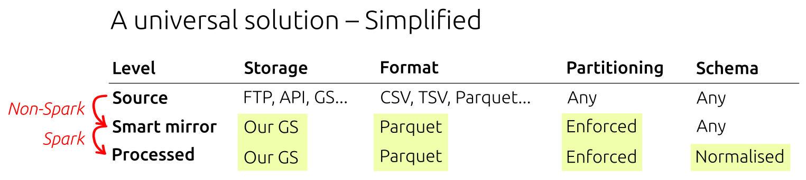

# Ingestion of external data using Google Cloud Batch

## Introduction

Spark on Dataproc works best when it is fed the data which is already in Parquet format, adequately partitioned, and is available to read from a Google Storage bucket.

However, almost all external data sources do not fit those criteria. This leads to very complicated and inefficient pipelines where Spark struggles to read large, non-partitioned, gzip-compressed TSV or CSV files.

The collection of modules in this repository solves this problem by implementing a separate preprocessing, non-Spark step running on Google Batch. The data is not modified, but is appropriately repartitioned and stored in Parquet format inside Google Storage.



## Commands

All commands need to be run relative to the root of the repository.

### List data sources available for ingestion

```bash
./submit.py --help
```

### Ingest a specific data source

```bash
./submit.py eqtl_catalogue
```

This command will submit a batch job to Google Cloud Batch. You can monitor the progress using the web interface at https://console.cloud.google.com/batch/jobs.

## Outputs

Code is deployed to `gs://gentropy-tmp/batch/staging/code`.

Logs for each run will be saved to `gs://gentropy-tmp/batch/staging/logs`.

The outputs will be saved to `gs://gentropy-tmp/batch/output`.
